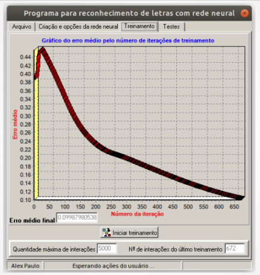

# Data Science - RNAs - Treinamento Supervisionado

## Exercício

Execute as seguintes tarefas:

### 1) Crie um software que seja programado para ler um arquivo TXT com o seguinte conteúdo:

010  
101  
111  
101  
101  
00000Letra A  
  
111  
100  
110  
100  
111  
10000Letra E  
  
010  
010  
010  
010  
010  
11000Letra I  
  
111  
101  
101  
101  
111  
11100Letra O  
  
101  
101  
101  
101  
111  
11110Letra  U  
  
  

O conteúdo do arquivo a ser lido (visto acima) possui cinco agrupamentos de dados. 
Cada agrupamento representa uma das vogais. Cada vogal será representada por uma
matriz de cinco linhas por três colunas. A sexta linha de cada agrupamento, após
os dados de entrada para o treinamento, representa a saída desejada para a letra
que será treinada.
  

### 2) Se julgar necessário, para observar uma implementação do que está sendo solicitado neste exercício, baixe o arquivo TesteRedeNeural.exe (disponível neste repositório). Crie um arquivo de texto e grave nele o conteúdo visto na questão 1 deste exercício. Utilize o software baixado para compreender o funcionamento do treinamento supervisionado. 

### 3) Crie um rede neural para treinamento supervisionado, considerando o conteúdo lido, do arquivo citado, como o mapa de treinamento. O objetivo é atingir o erro médio máximo parametrizado, conforme visto na imagem:

### 4) Construa, no mesmo software, uma interface para testar a rede neural após o seu treinamento.
